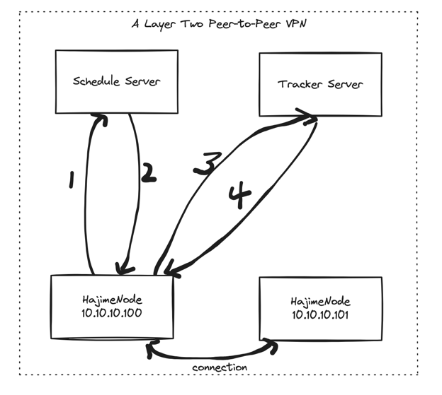
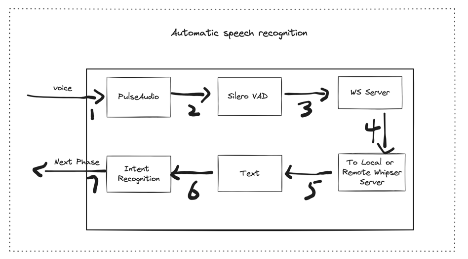
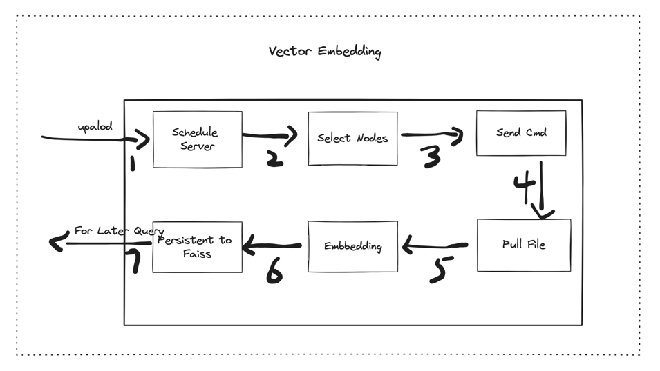
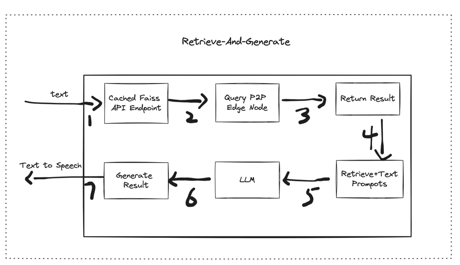

# Hajimebot

Hajimebot  is designed to be a  low-latency edge device for Hajime Network. 
Different nodes can communicate with each other and provide AI computing power ,  AI Services such as ASR , Vector Embedding , Vector Querying , LLM and so on.
We can build  AI products on the Hajime Network. Such as building a knowledge sharing network,Companion robot ,etc.


## Features
- P2P network allowing Hajimebot to join and leave anytime,any node can communicate with other nodes
- RAG（Retrieve-And-Generate）, combines the strengths of retrieval-based and generative models to effectively answer questions by first retrieving relevant information from a knowledge source and then generating a coherent response based on that information
- Vector embedding, capture the semantic meaning and syntactic structure of language in a way that is computationally efficient
- Vector querying, retrieving documents from a dataset based on the similarity of  numerical vector representations
- Automatic speech recognition (ASR), convert audio to text
- Local and Remote LLM, for chatting and reasoning
- Text-to-Speech, convert text to audio


## Prerequisites
- Ubuntu 22.04 LTS
- Python 3.10
- Cuda 12.1
- GPU, Tested on Nvida RTX 4060、4090、Jetson Orin Nano

## POC Design


Hajimebot should be run using GPU for better performance. *The rest of section uses **Ubuntu 22.04** as the reference for environment set-up.*

### Build P2P Connection


1, Hajimebot requested ip from schedule server

2, Schedule server fetched 1 ip from ip pools and return to Hajimebot

3, Hajimebot connected to Tracker server and try to join the p2p network

4, Tracker server assists Hajimebot in traversing NAT and firewalls and build connection with other nodes

### Automatic speech recognition 


1, Hajimebot start recording audio through PulseAudio

2, Get voice sentence data by Siero VAD

3, Send voice sentence data local main websocket server

4, The main websocket server send voice byte data to local or remote whisper server

5, whisper server transcribe voice sentence data to text

6, Intent Recognition and decide to next step

### Vector embedding

1, Users upload files to Hajime Schedule Server

2, Schedule Servers select Hajime Nodes to process files

3, Schedule Servers send the command to the selected nodes

4, Hajime Nodes start to pull files to local 

5, Hajime Nodes start to vectorize text, speech, and video data.

6, Store the vectorized data in the FAISS database.


### RAG



1, Get Vector Querying API Endpoints and cache them in local, and cache them in local, 

2, Query the vector database through P2P Network

3, Get Result from Vector Querying API Endpoints

4, Combine the retrieved documents with the user's query and prompts and send it to LLM

5, Select local or remote LLM to generate a response.

6, LLM generates a response to the combined query.

7, The response   sends to the Text to speech engine to generate audio and play.


## Installation
```
# get codes from git
git clone <git-repo-url>
cd <path-to-node-app>
mkdir -p cache/speech/record logs/ models/whisper
chmod 755 ./audio_capture.sh ./start.sh

# packages install
apt install python3.10-dev python3.10-venv portaudio19-dev n2n
apt install libcairo2-dev python-gi-dev libgirepository1.0-dev 
apt-get install libsdl2-dev git cmake screen ffmpeg

# install python virtual env
python3.10 -m venv .venv
source .venv/bin/activate

# python requirements install
pip install torch==2.2.1+cu121 torchvision==0.17.1+cu121 torchaudio==2.2.1+cu121 -f https://mirror.sjtu.edu.cn/pytorch-wheels/torch_stable.html

pip install faiss-gpu==1.7.2
cd .venv/lib/python3.10/site-packages/faiss
ln -s swigfaiss.py swigfaiss_avx2.py

pip install paddlepaddle-gpu==2.6.0.post120 -f https://www.paddlepaddle.org.cn/whl/linux/mkl/avx/stable.html
pip install rapidocr-paddle==1.3.17

pip install -r requirements.txt

# start pulseaudio daemon to system wide
addgroup root pulse-access
/usr/bin/pulseaudio --daemonize=true --system --disallow-exit --disallow-module-loading

# download model for vector store embedding 
mkdir models
cd <path-to-node-app>/models
GIT_LFS_SKIP_SMUDGE=1 git clone https://hf-mirror.com/BAAI/bge-large-en-v1.5
wget https://hf-mirror.com/BAAI/bge-large-en-v1.5/resolve/main/model.safetensors?download=true
mv 'model.safetensors?download=true' bge-large-en-v1.5/model.safetensors
wget https://hf-mirror.com/BAAI/bge-large-en-v1.5/resolve/main/pytorch_model.bin?download=true
mv 'pytorch_model.bin?download=true' bge-large-en-v1.5/pytorch_model.bin
# download and compile whisper.cpp
cd /opt
git clone https://github.com/ggerganov/whisper.cpp.git
cd whisper.cpp
git checkout 725350d4ea1545d890fe41f815b851cbc57838f6
cmake -B build -DWHISPER_CUBLAS=ON -DWHISPER_SDL2=ON
cmake --build build -j --config Release
cp build/libwhisper.so <path-to-node-app>/whisper/

# download whisper ggml model
cd <path-to-node-app>/models/whisper
wget https://hf-mirror.com/ggerganov/whisper.cpp/resolve/main/ggml-medium.bin?download=true
mv 'ggml-medium.bin?download=true' ggml-medium.bin
```

## Quick start running
```
# create blank database
cd <path-to-node-app>
python ./commands.py --create-tables

# start main service
python ./main.py
```

```
# start audio capture
python ./audio_capture.py
```

## Starting on boot
```
vim /lib/systemd/system/hjm-main.service

[Unit]
Description=Hajime bot node app main
After=network-online.target sound.target
[Service]
User=root
Type=simple
ExecStart=/bin/bash <path-to-node-app>/start.sh
ExecReload=/bin/kill -HUP $MAINPID
Restart=always
StandardOutput=append:<path-to-node-app>/logs/main.log
StandardError=append:<path-to-node-app>/logs/main.log

[Install]
WantedBy=multi-user.target
WantedBy=graphical.target

```

```
vim /lib/systemd/system/hjm-audio-capture.service

[Unit]
Description=Hajime bot audio capture
After=hjm-main.service

[Service]
User=root
Type=simple
ExecStart=/usr/bin/bash <path-to-node-app>/audio_capture.sh
ExecReload=/bin/kill -HUP $MAINPID
Restart=always
StandardOutput=append:<path-to-node-app>/logs/audio-capture.log
StandardError=append:<path-to-node-app>/logs/audio-capture.log

[Install]
WantedBy=multi-user.target
WantedBy=graphical.target

```

```
systemctl enable hjm-main.service
systemctl enable hjm-audio-capture.service
```# Hajimebot
